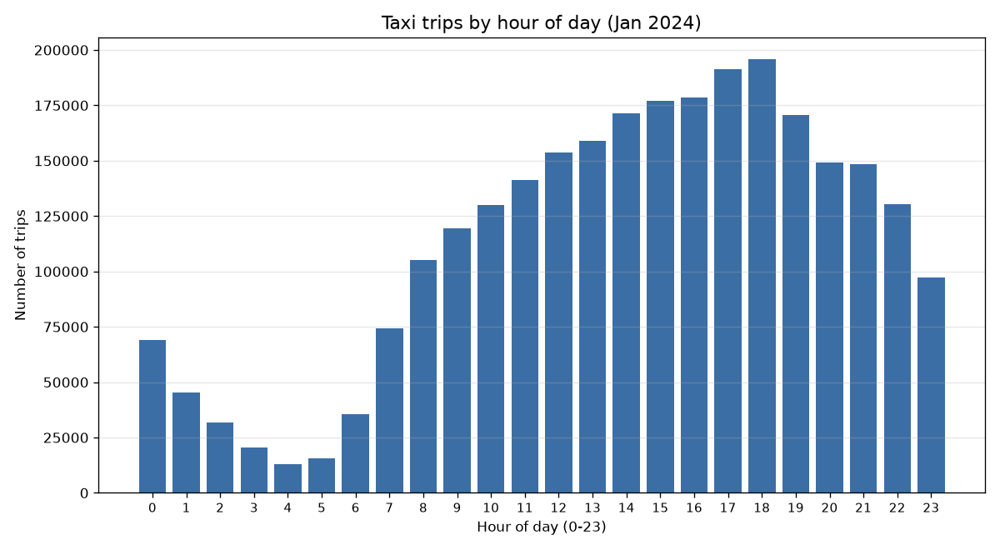
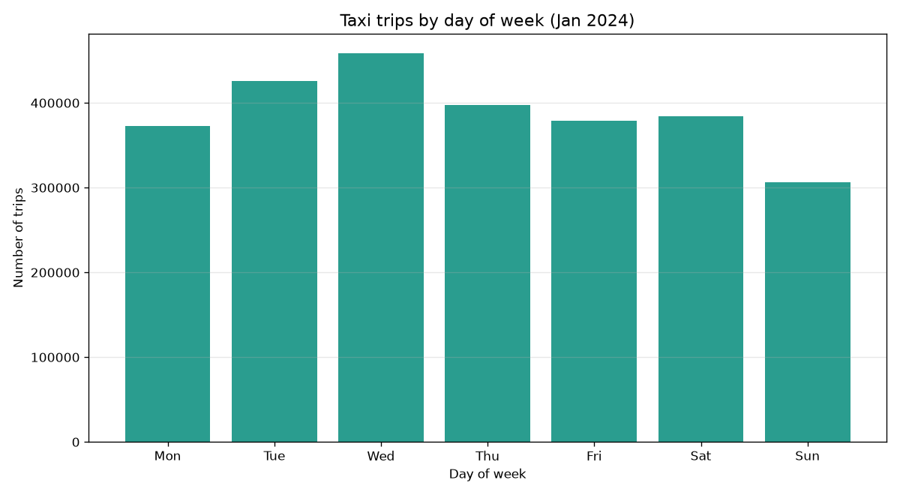
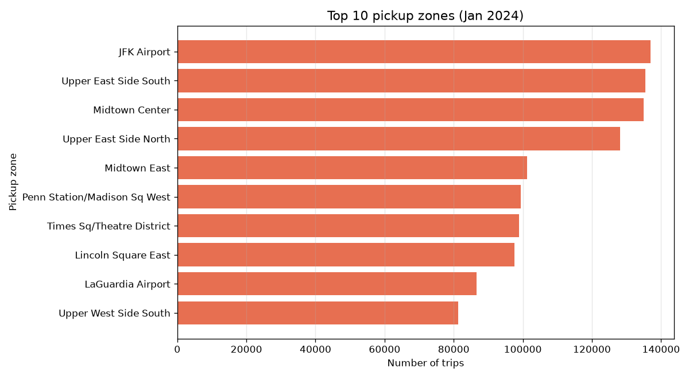
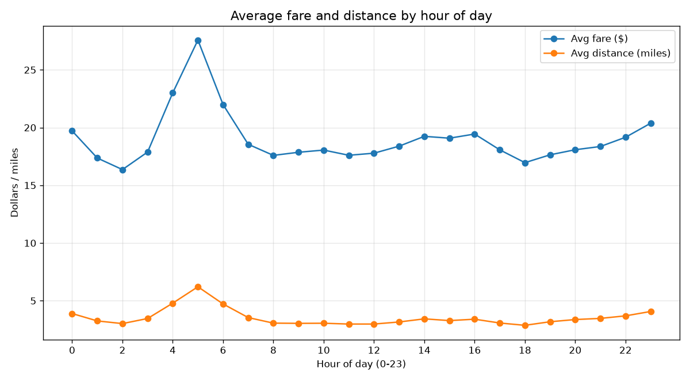
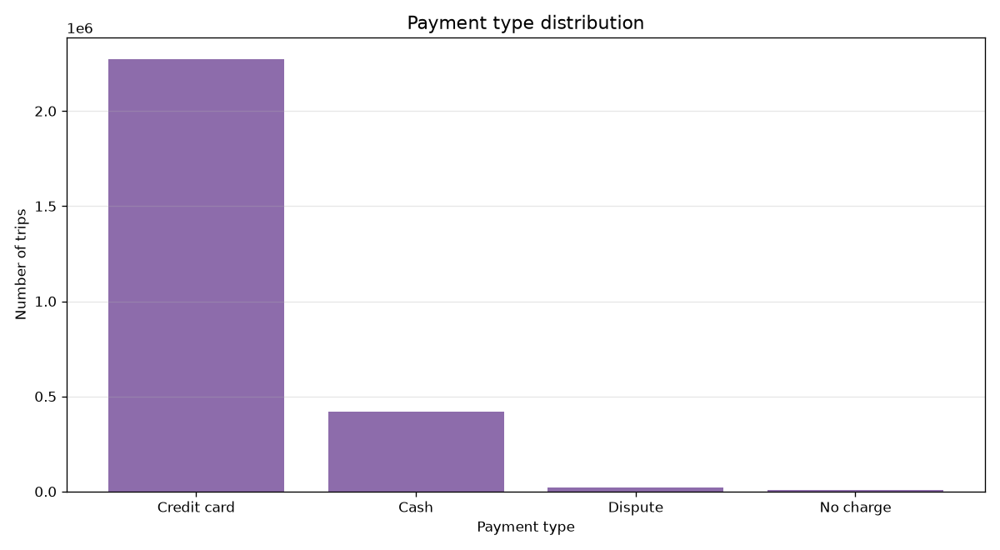
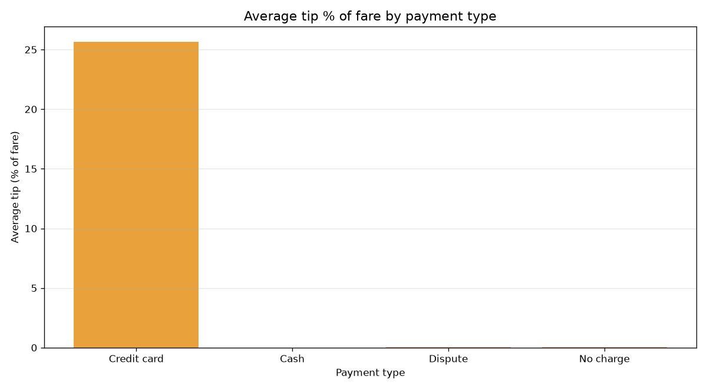
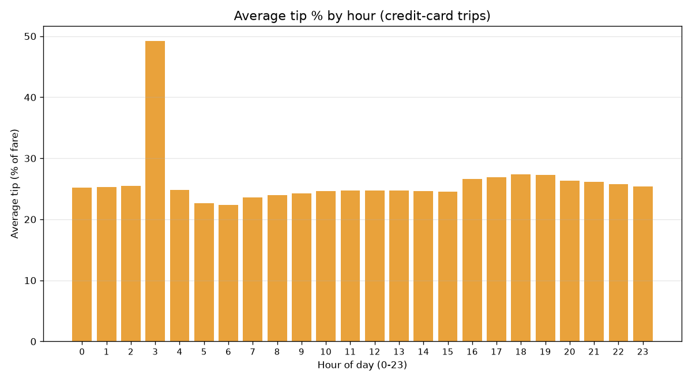
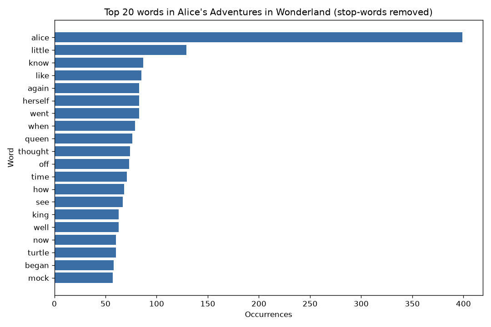

# bigdata-spark-analysis


A beginner-friendly Big Data portfolio project that analyses ~3 million NYC Yellow Taxi trips (January 2024) with PySpark and demonstrates the concepts from Simplilearn's *Introduction to Big Data* course: the 5 Vs, structured vs unstructured data, HDFS, MapReduce and the Hadoop ecosystem. It includes a MapReduce word-count demo (pure Python and Spark RDD), six reusable analysis jobs, charts, an executed notebook and a pytest suite.

**Author:** Shreya Tiwari

## Dataset
- **NYC TLC Yellow Taxi Trip Records, January 2024** (Parquet, ~50 MB, 2,964,624 rows) - https://www.nyc.gov/site/tlc/about/tlc-trip-record-data.page
- **Taxi Zone Lookup** (CSV) - same page.
- **Alice's Adventures in Wonderland** from [Project Gutenberg](https://www.gutenberg.org/ebooks/11) (public domain) for the word-count demo.
- Data licence: TLC data is published as open data by the City of New York under the [NYC Open Data terms of use](https://www.nyc.gov/html/data/terms.html).

Full raw data is **not** committed (`data/raw/` is gitignored). A 1,000-row sample is in `data/sample/` so tests run quickly.

## Setup
Requirements: Python 3.10+, Java 17 (Temurin recommended), git.

```bash
python -m venv .venv
.venv\Scripts\activate          # Windows  (source .venv/bin/activate on Linux/macOS)
pip install -r requirements.txt
```

### Run
```bash
python scripts/download_data.py          # 1. download data + build sample
python src/wordcount_mapreduce.py        # 2. MapReduce demo
python src/analysis.py                   # 3. analysis -> outputs/results + outputs/charts
jupyter nbconvert --to notebook --execute --inplace notebooks/analysis.ipynb   # 4. notebook
python -m pytest -q                      # 5. tests
```

## Charts
| | |
|---|---|
|  |  |
|  |  |
|  |  |
|  |  |

## Key findings
- **Data quality:** 240,827 of 2,964,624 rows (8.1%) were invalid and removed: 38,341 non-positive fares, 56,569 zero distances, 30,660 zero/missing passenger counts and 8 trips with dropoff before pickup. 2,723,797 rows remain.
- **Hourly demand:** peaks at 18:00 (195,918 trips) and is lowest at 04:00 (12,783), a ~15x swing.
- **Weekly pattern:** Wednesday is busiest (458,785 trips); Sunday is quietest (306,407).
- **Hotspots:** JFK Airport is the top pickup zone (136,959 trips), then Upper East Side South (135,461) and Midtown Center (134,967). LaGuardia is also in the top 10.
- **Fares:** the priciest trips start at 05:00 (avg $27.58, 6.2 miles); mid-day trips average ~$18 and ~3 miles.
- **Payments & tips:** credit card 83.5% of trips, cash 15.3%. Card riders tip 25.7% of the fare on average; cash tips are not recorded.

## Concepts applied
| Concept | Where in the project |
|---|---|
| **Volume** | ~3M-row Parquet file processed with Spark partitions (`src/analysis.py`) |
| **Velocity** | Monthly releases of continuously generated trips; discussed in `docs/report.md` (streaming would use Spark Structured Streaming/Kafka) |
| **Variety** | Structured Parquet/CSV vs unstructured book text (`src/wordcount_mapreduce.py`) |
| **Veracity** | Cleaning step removing invalid rows and a cleaning report (`clean_trips`) |
| **Value** | Demand, zone, fare and tip insights in the notebook and charts |
| **HDFS** | Parquet is block/columnar storage built for HDFS; scaling discussion in `docs/report.md` |
| **MapReduce** | `map_phase` / `shuffle_phase` / `reduce_phase` and the Spark RDD version |
| **Hadoop ecosystem** | Spark (processing), Parquet (storage format), YARN (resource manager) and Hive-style SQL aggregations, discussed in the report |

## MapReduce flow
```
 INPUT            MAP                SHUFFLE (group by key)        REDUCE            OUTPUT
 "a b a"   --> (a,1)(b,1)(a,1) -->  a: [1,1,1]                 --> a: 3          --> a 3
 "c b a"   --> (c,1)(b,1)(a,1) -->  b: [1,1]                   --> b: 2          --> b 2
                                    c: [1]                      --> c: 1          --> c 1
 (lines split     (emit word,1)     (move all pairs with the      (sum the list)    (write result)
  across nodes)                      same key to one node)
```

## Project layout
```
src/spark_session.py        SparkSession builder with Windows fixes
src/wordcount_mapreduce.py  MapReduce word count (pure Python + Spark RDD)
src/analysis.py             reusable analysis functions
scripts/download_data.py    data download + sample builder
notebooks/analysis.ipynb    executed walkthrough
tests/test_analysis.py      pytest suite (8 tests)
docs/report.md              full report
```

## Assumptions
- Month chosen: January 2024. Only rows with a pickup time in that month are used for the committed sample; the full file is analysed as downloaded.
- Null `passenger_count` is treated as invalid (removed with the `<= 0` rule).
- Tip % = `tip_amount / fare_amount * 100`. Cash tips are not recorded by TLC, so tip-by-hour uses credit-card trips only.
- Payment code 0 is mapped to "Flex fare"; any unmapped code is shown as "Other".

## Setup notes
- `gh` (GitHub CLI) was not installed, so the repo was pushed with plain `git` to an existing remote.
- Spark prints a harmless `winutils.exe` warning on Windows. All reads and writes of results use pandas for the small aggregated outputs (`.toPandas()`), so winutils/`hadoop.dll` were **not** needed. `src/spark_session.py` still sets `HADOOP_HOME` automatically if you place them in `hadoop/bin/`.
- `PYSPARK_PYTHON` is set to the running interpreter, and `src/` is added to `PYTHONPATH` so Spark Python workers can import project modules.
- A pandas 3.x / PySpark FutureWarning appears; it does not affect results.
